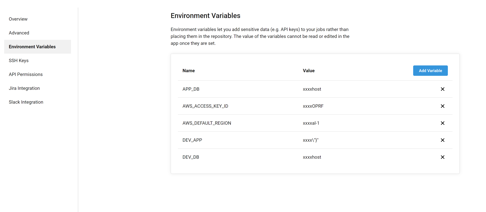

## Supported environment
- DEV
- STAGE
- PROD

## How to set environment variable for different env
The can be done simply converting the key to upper case and prefix with the env.
example: If you have a env key sentry_api then you can set set PROD_SENTRY_API for production 

## How to set environment in Circle CI
The environment is always a key value, So we need to save it in similar format
If the envrionment is structured like
```
db:
  name: localhost
  port: 3306
```
Then we need to save the key value format 
```
DEV_DB="{\"host\":\"localhost\",\"port\":3306}"
```

And if the environment has just a key value like
```
name: hello world
```
The save the key and value 
```
DEV_NAME="hello world"
```

